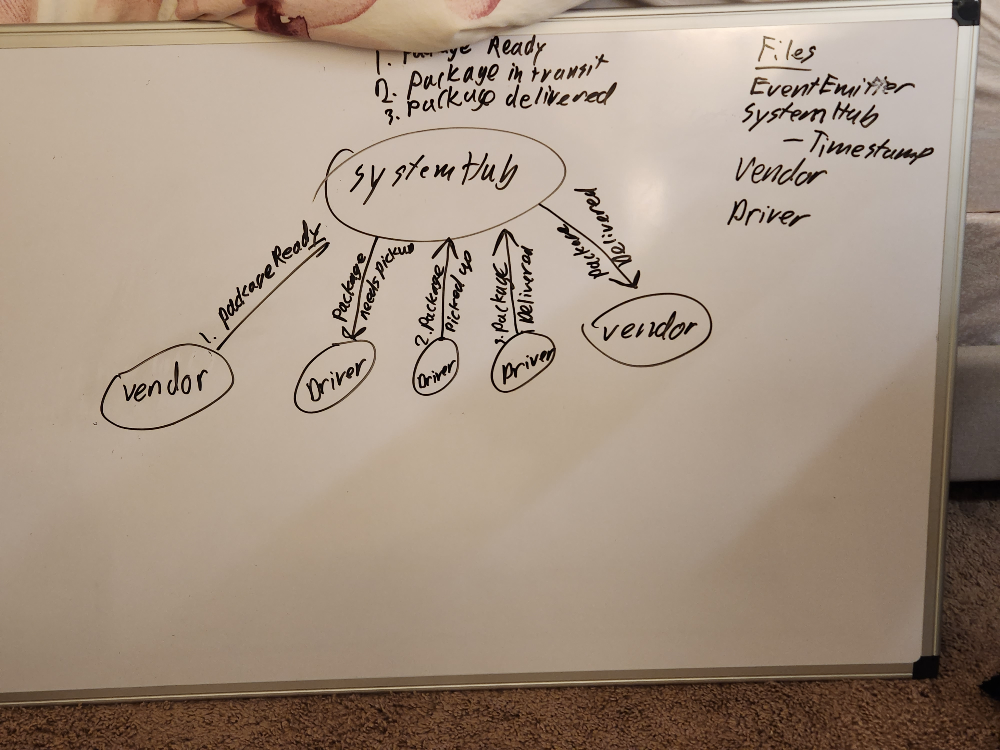

# CAPS  

## UML  

## Description  

Everything needed to run this application is included. `node ./lib/systemHub` will run the file. I have created a vendor and driver file that handle package anoucements and transit respectively. All of the event listeners are in the systemHub file.