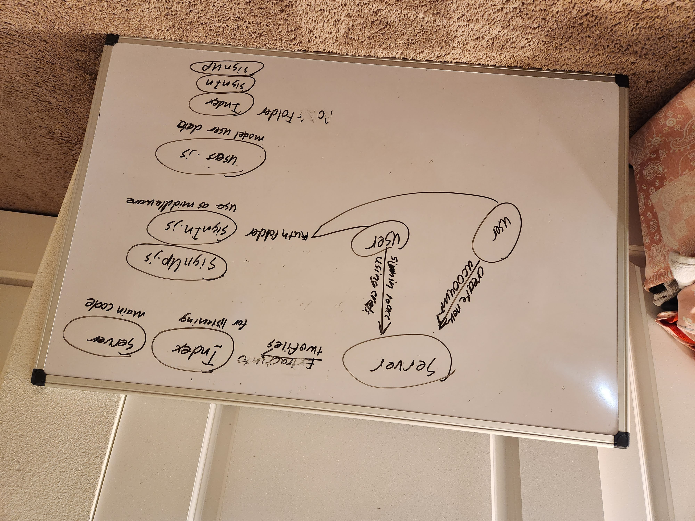

# CAPS  

## UML  

## Description  

Everything needed to run this application is included. `node ./lib/systemHub` will run the file. I have created a vendor and driver file that handle package anoucements and transit respectively. All of the event listeners are in the systemHub file.

## Phase 2  

## UML  

  

## Descrition  
live deploy: https://phase2caps.herokuapp.com/systemHub
You can run this site by running node index in the vendor and driver folders. I made sure to only transmit the delivered message to the correct vendor by having them join their own room based on their socket id.  
